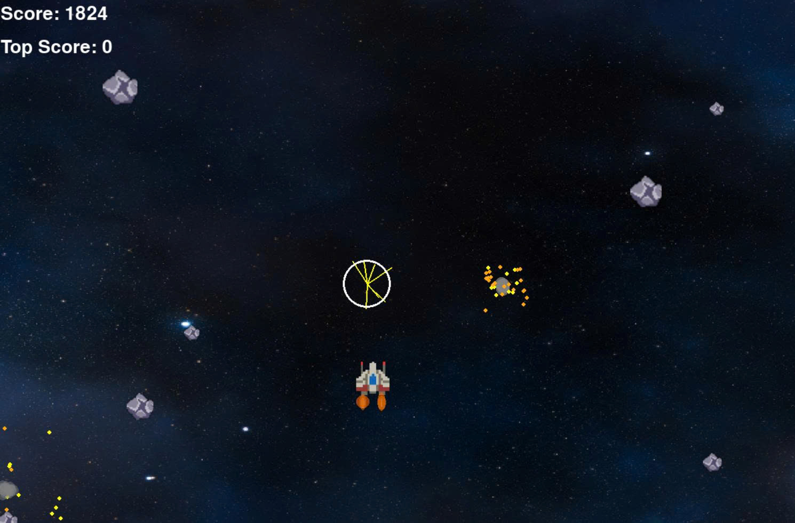

# Dodger Game 🎮

A simple dodge-the-obstacles game developed in Python using **Pygame**. Control your player character to avoid falling enemies and survive as long as possible while your score increases!

---

## 🎮 Gameplay

### Main Menu

*Navigate the game menu to start playing or view high scores*

### Gameplay Screen

*Dodge enemies and survive! Watch your score increase as you avoid obstacles*

---

## 🚀 Features
- **Flexible Controls**: Use keyboard (W/A/S/D or arrow keys) or mouse to move
- **Dynamic Graphics**: Smooth animations with fire effects
- **Sound & Music**: Background music and sound effects
- **Score System**: Points increase continuously while you survive
- **High Score Tracking**: Your best score is automatically saved

---

## 🛠️ Installation

### Requirements
- Python >= 3.8
- pygame >= 2.0.0

Install dependencies:
```bash
pip install -r requirements.txt
```

### Run the Game
```bash
python main.py
```

---

## 🎮 How to Play
- **W or Up Arrow**: Move up
- **S or Down Arrow**: Move down
- **A or Left Arrow**: Move left
- **D or Right Arrow**: Move right
- **Mouse**: Alternative control method
- **R**: Restart after game over
- **ESC**: Quit game

---

## 📁 Project Structure
```
dodger_game/
├── assets/
│   ├── images/              # Game graphics
│   └── musics_and_sounds/   # Audio files
├── core/                    # Core game modules
│   ├── player.py
│   ├── enemy.py
│   ├── explosion.py
│   └── world.py
├── utils/                   # Utility functions
│   ├── helpers.py
│   └── menu.py
├── config.py                # Game configuration
├── main.py                  # Main entry point
└── requirements.txt         # Dependencies
```

---

## 🛠️ Technologies
- **Language**: Python 3.12
- **Framework**: Pygame
- **Audio**: Pygame mixer

---

## 📜 License
This project is open source. Feel free to use, modify, and distribute.

---

## 🎯 Tips to Win
- Use keyboard controls for precise movement
- Watch for enemy patterns
- Don't touch the screen edges
- Collect achievements by lasting longer
- Beat your high score!

Enjoy the game! 🎉